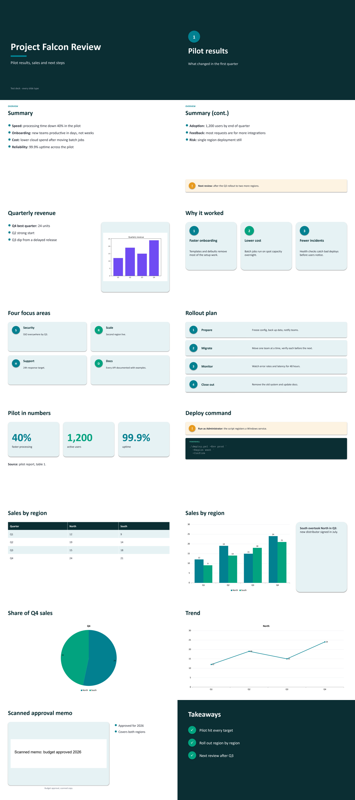
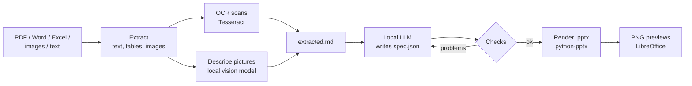
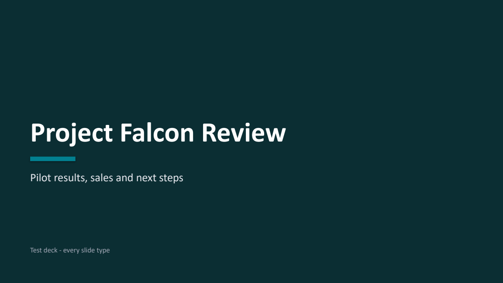
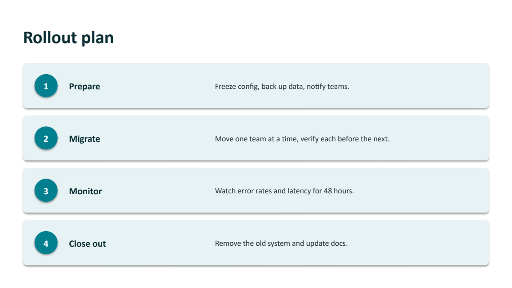
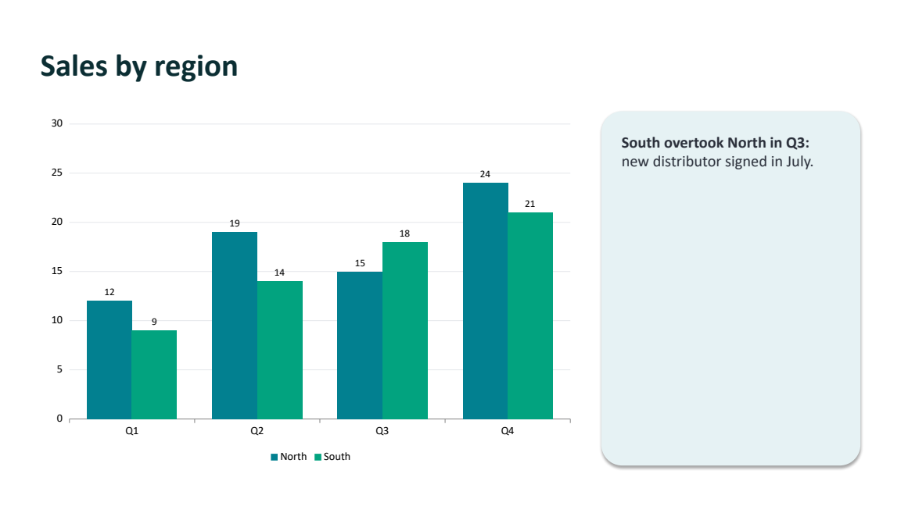
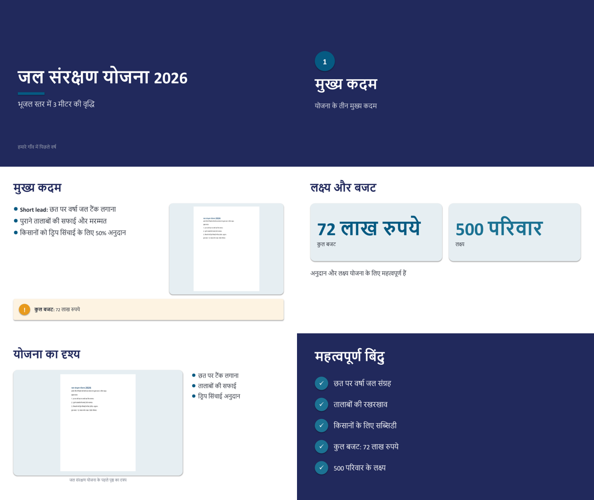

# Cursed_PPTMaker

**Turn PDFs, scanned documents, Word files, Excel sheets and images into polished,
animated PowerPoint decks — completely offline.**

A local LLM (via [Ollama](https://ollama.com)) reads your documents and decides what
goes on each slide. A Python renderer turns that into a styled `.pptx` with cards,
numbered steps, stat callouts, code blocks, native charts and fade animations.
No cloud API, no account, no internet needed once it is set up.



---

## Contents

- [Features](#features)
- [How it works](#how-it-works)
- [Quick start](#quick-start)
- [Installation](#installation)
- [Usage](#usage)
- [Supported inputs](#supported-inputs)
- [Slide types](#slide-types)
- [The slide spec](#the-slide-spec)
- [Hindi and other scripts](#hindi-and-other-scripts)
- [Is it really offline?](#is-it-really-offline)
- [Choosing a model](#choosing-a-model)
- [Configuration](#configuration)
- [Troubleshooting](#troubleshooting)
- [Limitations](#limitations)
- [Project structure](#project-structure)
- [License](#license)

---

## Features

- **Any input:** PDF (text or scanned), Word (`.docx`, `.doc`, `.odt`, `.rtf`), Excel
  (`.xlsx`, `.xls`, `.ods`, `.csv`), PowerPoint (`.pptx`, `.ppt`, `.odp`), images and
  plain text. Mix several files into one deck.
- **Designed slides, not bullet dumps:** 11 slide types with a consistent visual system
  and 10 colour palettes. Text auto-shrinks to fit its box.
- **Native, editable charts** built from the real numbers in your Excel sheets.
- **Animations:** fade transition on every slide, and content that fades in piece by
  piece automatically — no clicking.
- **OCR for scans** (Tesseract), with automatic script detection: Devanagari pages are
  read as Hindi + English.
- **Understands pictures:** a local vision model describes photos and diagrams so they
  get sensible titles and captions. No picture you supply is dropped.
- **Guard rails for small models:** invented chart data, dropped commands and padding
  slides are detected and sent back to the model to fix.
- **Previews:** every build is rendered to PNG (one per slide plus a contact sheet).
- **Editable output:** the model's slide content is saved as `spec.json`; edit it and
  rebuild in seconds without the model.
- **Provenance stamp:** each deck records which models made it, in
  *File → Info → Properties → Comments*.
- **Desktop app:** a frosted-glass window with drag-and-drop, a model picker that knows
  what fits in memory, live progress, slide thumbnails and a choice of save folder.
- **Console launcher** too, for a no-frills double-click workflow.

## How it works



1. **Extract** — text, tables and embedded images are pulled from every input.
   Scanned pages are OCR'd; pictures are described by a vision model.
2. **Plan** — a local model reads the extract and writes a JSON *slide spec*: which
   slide types to use and what goes in them.
3. **Check** — the spec is validated (schema, image paths, chart values must exist in
   the source, commands must not be dropped, not too many section slides). Problems are
   sent back to the model, up to 3 attempts.
4. **Render** — the spec is drawn with fixed, tested layouts, then animated.
5. **Preview** — LibreOffice renders each slide to PNG so you can check it at a glance.

Because the design lives in the renderer, even a small local model produces a
consistent, good-looking deck. The model only has to decide *content*.

## Quick start

```bash
# 1. Install Python packages
pip install -r requirements.txt

# 2. Get a local model
ollama pull qwen3:8b

# 3. Make a deck
python make_ppt.py auto "report.pdf"
```

On Windows, double-click **`Cursed PPTMaker.bat`** for the desktop app instead of step 3.

## Installation

Tested on Windows 11 with Python 3.14. The Python code is cross-platform; the
launcher (`.bat` / `.ps1`) is Windows-only.

| Requirement | Why | Get it |
|---|---|---|
| Python 3.12+ | runs everything | [python.org](https://www.python.org) |
| Python packages | reading files, building slides | `pip install -r requirements.txt` |
| [Ollama](https://ollama.com) + a model | writes the slide content | `ollama pull qwen3:8b` |
| [LibreOffice](https://www.libreoffice.org) | previews, legacy `.doc/.xls/.ppt` | optional but recommended |
| [Tesseract OCR](https://github.com/UB-Mannheim/tesseract/wiki) | scanned PDFs and images | optional; language data is bundled in `tessdata/` |
| A vision model | describes photos/diagrams | optional: `ollama pull llama3.2-vision` (or `llava`, `moondream`) |

Default install paths (override with env vars, see [Configuration](#configuration)):

- LibreOffice: `C:\Program Files\LibreOffice\program\soffice.exe`
- Tesseract: `C:\Program Files\Tesseract-OCR\tesseract.exe`

Everything is downloaded once. After that, the whole pipeline runs without internet.

## Usage

### Desktop app

Double-click **`Cursed PPTMaker.bat`** (it starts `app.py` without a console window).

| Area | What you can do |
|---|---|
| **Sources** | drop files onto the window, or click to browse; remove any with ✕ |
| **Model** | pick from your installed offline models, with sizes; a blue dot means it fits in free memory right now, grey means it may not |
| **Slides / Focus** | slide count (4–20) and optional guidance such as `audience: management` |
| **Animations / Describe images** | turn fade animations and vision descriptions on or off |
| **Save to** | choose a folder for the deck and its working files, or ✕ to save next to the first source file (remembered between sessions) |
| **Progress** | four steps light up as it reads, looks at pictures, writes and builds; *Details* shows the full log |
| **Result** | open the deck or its folder, edit `spec.json` in Notepad and **Rebuild** in seconds, click thumbnails to enlarge, and see the offline stamp |

Only one window runs at a time (a second launch just tells you it is already open).
The app uses Windows' built-in Edge WebView2 to draw its interface — no browser or
internet needed.

### Console launcher

Double-click `Make PPT.bat` (or make a desktop shortcut to it):

1. **Pick files** in the dialog — hold Ctrl for several — or drag files onto the `.bat`.
2. **Pick a model** from the numbered menu. It shows each model's size, the memory free
   right now, and flags models that probably won't fit. Your last pick is the default.
   Cloud models are hidden so a run can never go online by accident.
3. **Slides and focus** — press Enter for the defaults (10 slides, no special focus).
4. The deck opens when it is done.

```
Installed offline models (free memory now: about 12 GB):
   3. llama3.2:latest              1.9 GB
  10. qwen3:8b                     4.9 GB
  15. qwen3-coder:30b             17.3 GB  <- default  (may not fit right now)
Pick a number, or press Enter for qwen3-coder:30b
```

Drag a `spec.json` onto the launcher to **rebuild** a deck after editing it — no model needed.

### Command line

```bash
# documents -> local model -> deck
python make_ppt.py auto report.pdf
python make_ppt.py auto proposal.docx figures.xlsx photo.jpg -n 12 -i "audience: management"
python make_ppt.py auto report.pdf -m qwen3:8b -o "Board deck.pptx"

# only extract (to inspect what the model will see)
python make_ppt.py extract report.pdf

# rebuild from a (hand-edited) spec
python make_ppt.py build report_ppt/spec.json

# print the slide spec format
python make_ppt.py schema
```

| Option | Applies to | Meaning |
|---|---|---|
| `-m, --model` | auto | Ollama model (default `qwen3-coder:30b`, or `MAKE_PPT_MODEL`) |
| `-n, --slides` | auto | target number of slides (default 10) |
| `-i, --instructions` | auto | extra guidance, e.g. `"audience: students, keep it simple"` |
| `-o, --out` | auto, build | output `.pptx` path |
| `--vision MODEL` | auto, extract | vision model for pictures (default: best installed) |
| `--no-vision` | auto, extract | don't describe pictures |
| `--no-animate` | auto, build | no transitions or animations |
| `--no-preview` | auto, build | skip the PNG previews |

### Output

Next to the first input file:

| Path | Contents |
|---|---|
| `report.pptx` (launcher: `report - slides.pptx`) | the deck; the launcher never overwrites, it adds `(2)`, `(3)`… |
| `report_ppt/extracted.md` | everything read from the sources |
| `report_ppt/assets/` | images pulled from the sources |
| `report_ppt/spec.json` | the slide content — edit and rebuild |
| `report_ppt/preview/` | `slide-01.png`… and `contact-sheet.png` |

## Supported inputs

| Type | Extensions | What is extracted |
|---|---|---|
| PDF | `.pdf` | text, tables, embedded images; scanned pages are OCR'd |
| Word | `.docx` (+ `.doc`, `.odt`, `.rtf` via LibreOffice) | headings, lists, tables, images |
| Spreadsheets | `.xlsx`, `.xlsm`, `.csv` (+ `.xls`, `.ods`) | every sheet as a table; totals for long sheets |
| PowerPoint | `.pptx` (+ `.ppt`, `.odp`) | slide text, tables, pictures, speaker notes |
| Images | `.png`, `.jpg`, `.jpeg`, `.bmp`, `.gif`, `.tif`, `.tiff`, `.webp` | OCR text + vision description |
| Text | `.txt`, `.md` | as is |

## Slide types

| Type | Looks like | Good for |
|---|---|---|
| `title` | dark, large title, subtitle | opening slide |
| `section` | dark divider with a numbered badge | separating parts of long decks |
| `bullets` | coloured bullets, bold lead-ins, optional side image and callout | key points |
| `cards` | 2–6 rounded cards with icon badges | features, options, pillars |
| `steps` | numbered rows | processes, how-tos |
| `stats` | big numbers with labels | KPIs, headline figures |
| `code` | dark code block with optional warning | commands, snippets |
| `table` | striped table, auto-split across slides | comparisons, reference data |
| `chart` | native column / bar / line / pie chart, optional commentary | numeric data |
| `image` | framed picture, caption, optional bullets | photos, diagrams, screenshots |
| `closing` | dark checklist | takeaways, next steps |

| | |
|---|---|
|  |  |
|  |  |

Long lists, tables and step sequences are split evenly across continuation slides.

## The slide spec

The model writes, and you can edit, a JSON file like this (`python make_ppt.py schema`
prints the full format):

```json
{
  "title": "Project Falcon Review",
  "palette": "teal",
  "slides": [
    {"type": "title", "title": "Project Falcon Review", "subtitle": "Pilot results"},
    {"type": "stats", "title": "Pilot in numbers",
     "stats": [{"value": "40%", "label": "faster processing"},
               {"value": "1,200", "label": "active users"}]},
    {"type": "chart", "title": "Sales by region", "chart": "column",
     "categories": ["Q1", "Q2", "Q3", "Q4"],
     "series": [{"name": "North", "values": [12, 19, 15, 24]}],
     "text": "Q4 was the best quarter."},
    {"type": "closing", "title": "Takeaways", "items": ["Pilot hit every target"]}
  ]
}
```

- Every slide can also have `kicker` (small label above the title) and `notes`
  (speaker notes).
- Palettes: `violet`, `midnight`, `forest`, `coral`, `terracotta`, `ocean`,
  `charcoal`, `teal`, `berry`, `cherry`.
- `"animate": false` at the top level turns animations off.
- [`examples/spec.json`](examples/spec.json) uses every slide type.

## Hindi and other scripts



- Scanned pages are checked with Tesseract's script detection. **Devanagari pages are
  read as Hindi + English**; everything else as English. Nothing to configure.
- Slides are written **in the language of the source** (Hindi in, Hindi out) unless
  you ask otherwise with `-i "write the slides in English"`.
- Text uses Nirmala UI for Indic scripts (ships with Windows), so Devanagari renders
  correctly in PowerPoint.
- To add another language, drop its `.traineddata` file from
  [tessdata_best](https://github.com/tesseract-ocr/tessdata_best) into `tessdata/`.
  Automatic selection currently covers Devanagari → Hindi; other scripts need a small
  change in `ocr_lang()`.

## Is it really offline?

Yes, once installed:

- File reading, OCR, slide rendering, animations and previews run locally.
- The only network connection the script makes is to **your own Ollama** at
  `localhost:11434`.
- Models whose names contain `cloud` run on someone else's servers. The launcher hides
  them; the CLI warns if you pass one.
- Every deck says how it was made, in *File → Info → Properties → Comments*, e.g.

  > Made OFFLINE by make_ppt.py on 2026-10-03. Slide content: qwen3:8b (Ollama).
  > Image descriptions: llama3.2-vision:latest. OCR: Tesseract hin+eng.

## Choosing a model

| Model | Size | Notes |
|---|---|---|
| `qwen3-coder:30b` | ~17 GB | best structure and content; needs ~16 GB free RAM + VRAM |
| `phi4` | ~8.4 GB | mid-size option |
| `qwen3:8b` | ~5 GB | fits most machines; decent in Hindi; slower (thinks first) |
| `llama3.2` | ~2 GB | fast, simple decks |

Bigger models pick better content; the renderer keeps the look consistent either way.
If a model doesn't fit, Ollama's error ("model requires more system memory…") is shown
with a hint — close heavy apps or pick a smaller model.

The context window is sized to your document, so short documents use less memory.

## Configuration

| Variable | Default | Purpose |
|---|---|---|
| `MAKE_PPT_MODEL` | `qwen3-coder:30b` | default slide model |
| `OLLAMA_HOST` | `http://localhost:11434` | Ollama address |
| `SOFFICE_PATH` | `C:\Program Files\LibreOffice\program\soffice.exe` | LibreOffice |
| `TESSERACT_PATH` | `C:\Program Files\Tesseract-OCR\tesseract.exe` | Tesseract |
| `TESSDATA_DIR` | `./tessdata` | OCR language data |

## Troubleshooting

| Problem | Fix |
|---|---|
| `model requires more system memory` | close browsers/other GPU apps, or choose a smaller model |
| `Cannot reach Ollama` | start Ollama (the launcher does this automatically) |
| `LibreOffice not found` | install it, or set `SOFFICE_PATH`; decks still build, just without previews |
| Scanned PDF gives no text | install Tesseract, or set `TESSERACT_PATH` |
| `Cannot write … is it open in PowerPoint?` | close the deck in PowerPoint and run again |
| Model keeps failing the checks | the last attempt is saved as `spec.json`; fix it and run `build` |
| Content is thin or slightly wrong | use a bigger model, add `-i` instructions, or edit `spec.json` |

## Limitations

- **Check numbers from scans.** OCR can misread digits (in testing, `12` became `72`),
  and the model has no way to know.
- Small models sometimes skip content or add a generic "next steps" item. Bigger models
  do better; `spec.json` is there for quick fixes.
- Vision models can get details wrong (e.g. where something is in a picture).
- Only the first 12 pictures per run are described, to keep runs fast.
- Previews come from LibreOffice, which ignores animations; open the deck in PowerPoint
  and press F5 to see them.

## Project structure

```
Cursed_PPTMaker/
├── make_ppt.py            # extract, build, auto, schema — the whole pipeline
├── app.py                # desktop app: window + bridge to make_ppt (pywebview)
├── ui/index.html         # the app's interface (HTML/CSS/JS, fully offline)
├── Cursed PPTMaker.bat   # starts the desktop app
├── make_ppt_launcher.ps1  # console front end: file picker, model menu, Ollama start-up
├── Make PPT.bat           # double-click / drag-and-drop entry point
├── requirements.txt       # Python packages
├── tessdata/              # Tesseract language data: eng, hin, osd
├── examples/              # spec using every slide type + the deck it builds
├── docs/images/           # screenshots for this README
└── PROGRESS_LOG.md        # development notes
```

## License

[MIT](LICENSE) for the code in this repository.

The files in `tessdata/` are from the [Tesseract OCR project](https://github.com/tesseract-ocr)
and are licensed under the [Apache License 2.0](tessdata/NOTICE.md).
